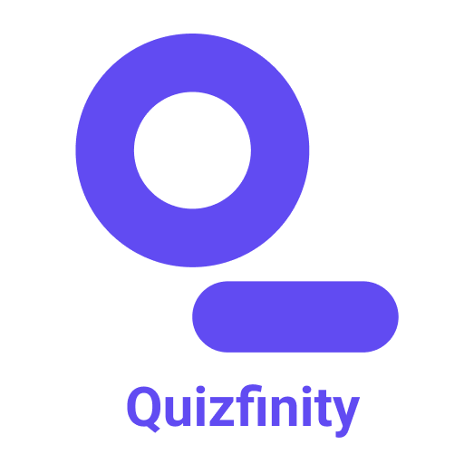

  

<h1 align="center">Quizfinity(A Quiz App)</h1>

  

## Introduction

Welcome to Quifinity! **[Quizfinity](https://quizfinity-showcase.vercel.app/)** is a mobile application designed to combine learning with fun through quizzes and trivia questions on various topics such as Technology, Science, Nature, Riddles, Literacy, and more. The app is suitable for users of all age groups, making it a versatile tool for education and entertainment.
