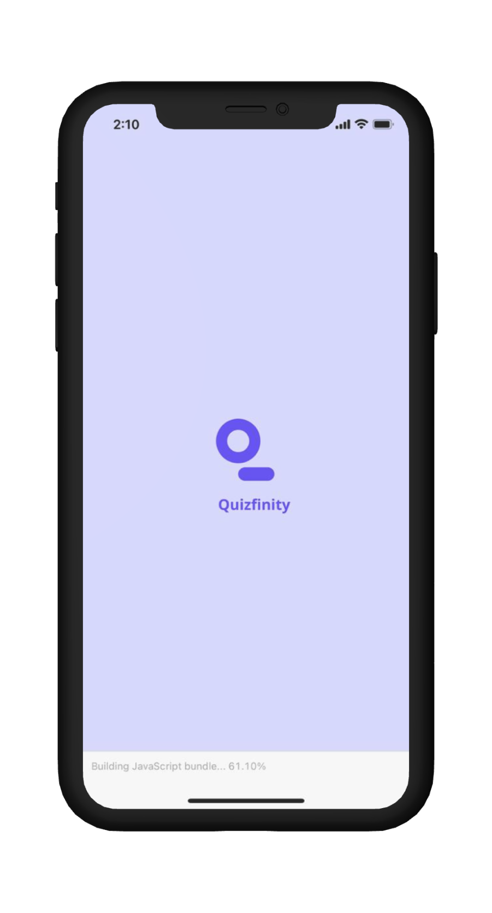
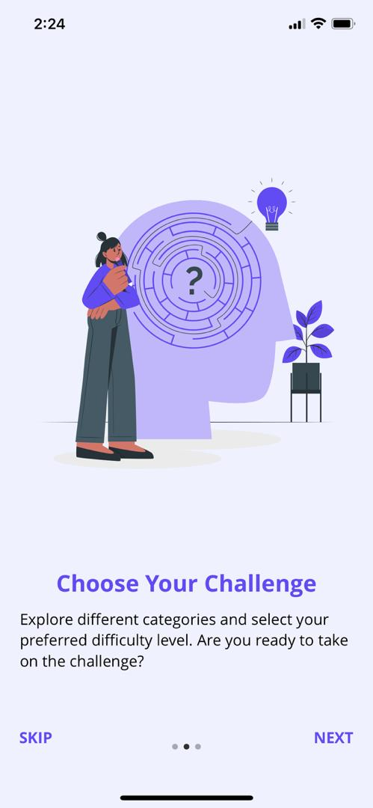
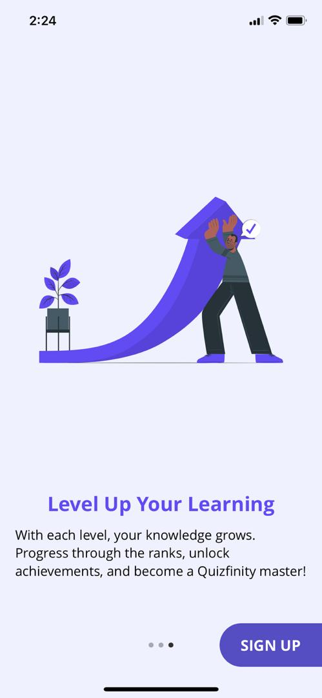
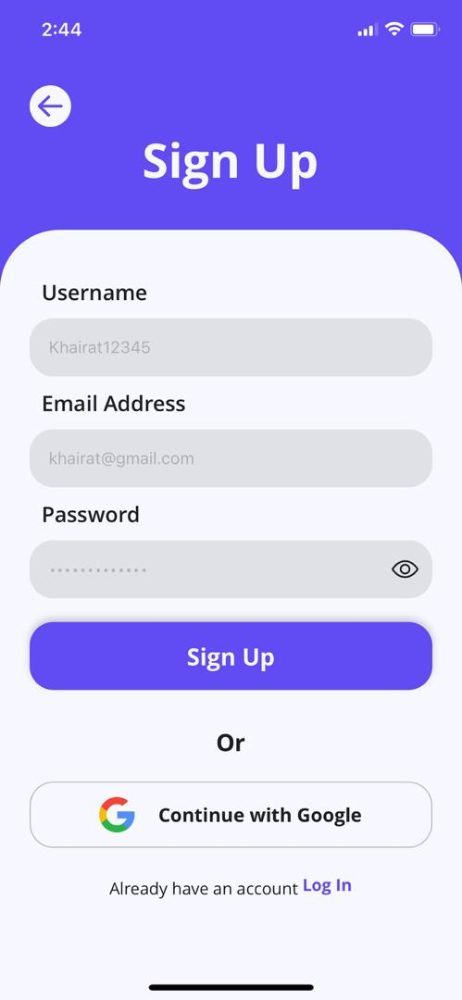
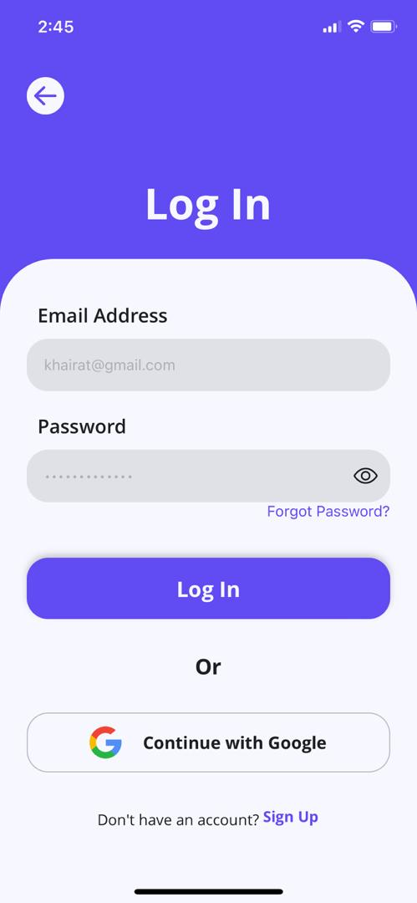
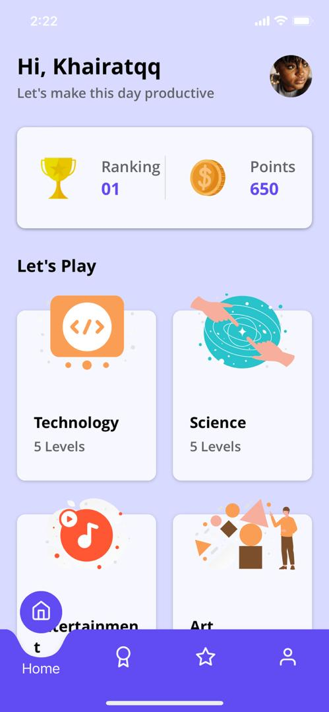
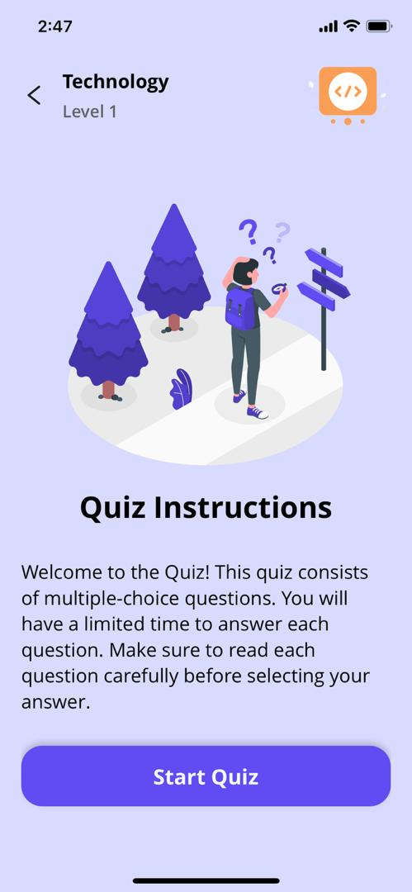
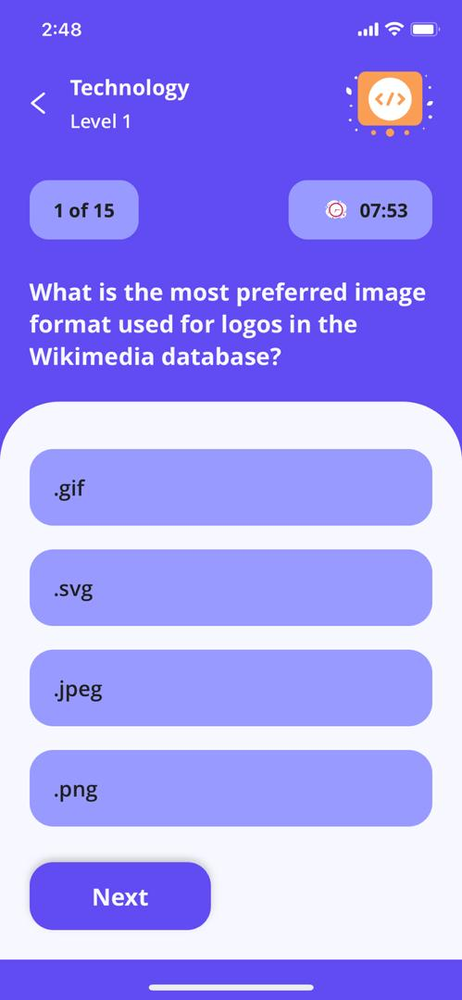
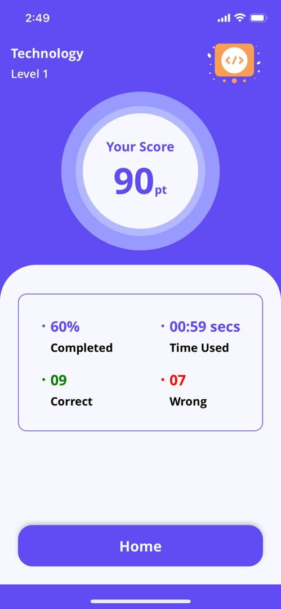

  

<h1 align="center">Quizfinity(A Quiz App)</h1>

  

## Introduction

Welcome to Quifinity! **[Quizfinity](https://quizfinity-showcase.vercel.app/)** is a mobile application designed to combine learning with fun through quizzes and trivia questions on various topics such as Technology, Science, Nature, Riddles, Literacy, and more. The app is suitable for users of all age groups, making it a versatile tool for education and entertainment.

## Key Features (MVP)

### Splash Screen

  

- <b>Logo Display</b>: The app's logo is displayed upon loading.

### Onboarding

  
  
  

- <b>Three-Page Slider</b>:  Introduces users to the app and its features, highlighting reasons to use Quizfinity.

### Authentication

  
  

- <b>Email and Password:</b>  Users can register and log in using their email addresses and passwords.

### Home Screen

  

- <b>Category Cards:</b>  Each category is displayed in a card were a user can select any category.

- <b>User's Rank:</b>  Displays the User's rank on the leaderboard.

- <b>User's Points:</b>  Displays the total points the user has earned.

### Quiz Screen

  
  
  

- <b>Question Display:</b> Shows the quiz question with 4 or 5 options.

- <b>Timer: </b> Displays a countdown timer for the level:

    
- Easy: 10 minutes per level

    
- Medium: 8 minutes per level

    
- Hard: 5 minutes per level

- <b>Post-Quiz:</b> After time elapses or the user submits their answers:

    
- Shows a "quiz over" screen indicating pass/fail status

    
- Allows progression to the next level if passed, or retrying the level if failed

    
- After completing all levels in a mode, a success page is displayed with an option to return to the list of modes.

## Technologies Used

### Frontend

- React Native
- TypeScript

### Backend / Database / Authentication

- Firebase

### External Database for Questions

- Open Trivia DB
